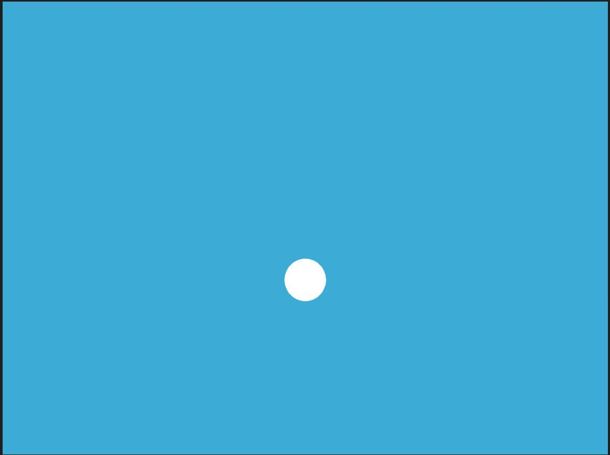

# 代码说明
## 说明
    框架的代码由以下一些代码构成。
```bash
.
├── AreaLight.hpp       # 描述面光源的头文件
├── Bounds3.hpp         # 包围盒类
├── BVH.cpp             # BVH
├── BVH.hpp             # BVH头文件
├── CMakeLists.txt      # cmake list
├── global.hpp          # common的一些函数以及定义
├── Intersection.hpp    # 光线和物体相交类
├── Light.hpp           # 光源类
├── main.cpp            # 主函数
├── Material.hpp        # 材料类
├── models
│   └── bunny
│       └── bunny.obj   # bunny 模型
├── Object.hpp          # 物体类
├── OBJ_Loader.hpp      # 加载obj文件
├── Ray.hpp             # 光线类
├── README.md
├── Renderer.cpp        # 渲染
├── Renderer.hpp        # 渲染
├── Scene.cpp           # 场景
├── Scene.hpp           # 场景 
├── Sphere.hpp          # 球体
├── Triangle.hpp        # 三角面类
├── Vector.cpp          # 数学矢量
└── Vector.hpp          # 数学矢量
```

##  框架说明
    本框架不依赖于操作平台和第三方库，没有采用GUI界面，只需要系统中安装有c工具链（包含make）和cmake即可。
使用方法如下：
```bash
mkdir build         # 创建编译文件夹
cd build            # 进入build文件夹
cmake ..            # 根据父文件夹的cmakelist生成makefile
make                # 编译出可执行程序
./RayTracing        # 运行程序
```

运行生成的可执行文件`RayTracing`后，渲染结果存储在`binary.ppm`文件中。

初始情况下，会渲染获得蓝色背景板下，一个白色的圆，这是在没有光照模型下，将光追遇到球体时，颜色值设置为球体原有的颜色白色造成的（消隐显示）。



## 渲染流程
- 从 main 函数开始。我们定义场景的参数，添加物体到场景中，并设置其材质，然后将光源添加到场景中。
- 调用 Render(scene) 函数。在遍历所有像素的循环里，生成对应的光线并将返回的颜色保存在帧缓冲区（framebuffer）中。在渲染过程结束后，帧缓冲区中的信息将被保存为图像。
- 在生成像素对应的光线后，我们调用 CastRay 函数，通过Scene::intersect获得交点。
- 然后，我们在此交点执行着色。我们设置了三种不同的着色情况。

## 需要完成的部分
> 完成基本功能需要填写的代码在代码中使用TODO标注了，但使用框架代码获得满分需要修改的代码很多，对于有一定基础的同学，建议从头开始实现。

- 如果采用BVH 
    - [ ] `Scene`中存在useBVH变量，用于控制是否使用BVH，`castRay`中根据该变量选择渲染方式。
    - [ ] 包围盒Bounds3.hpp中判断包围盒是否相交部分`Bounds3::IntersectP`
    - [ ] `BVH.cpp` 中，递归构造BVH树型结构`recursiveBuild`,求光线ray与BVH的交点`BVHAccel::getIntersection`
- 如果不采用BVH或采用其他加速方法
    - [ ] 修改`Scene`中关于`castRay,intersect`相关部分的代码，并将使用的方法数据结构（例如树）在`Scene`中;
- [ ] `main`函数对场景的设置加载;
- [ ] `Renderer::Render` 发射光线，得到颜色，存储在帧缓冲区;
- [ ] `Triangle::getIntersection,rayTriangleIntersect`三角形与光线交;
- [ ] `Scene::castRay`中计算得到每个像素的最终的颜色的方式，对于透明的，镜面的物体材质需要考虑递归调用`Scene::castRay`函数;
- [ ] 自行设置配置文件的读取加载;需要将局部坐标系转换成全局坐标系
- [ ] 自行添加代码实现物体的纹理; （可能需要修改`Material`）
- [ ] （可能需要）封装相机类，发射ray实现相机位置的改变
- [ ] （可能需要）更改`Renderer`和`Scene`中的部分代码，修改光照模型;

## 注意
- **本次作业的开放性和自由度很高，本次作业可以不依赖这个框架实现，完全自行实现，使用任意框架和语言都可以。本框架仅是为了防止部分同学无从下手提供**
- **可以修改本框架内的任意代码，只需要最终能够完成作业要求即可。**
- **独立完成，切勿抄袭**
- **你可能需要将最后输出图像的ppm格式转换为其他可以直接可以打开的图像格式（例如使用ffmpeg在转换，类Unix系统中一般可以直接打开该文件，但windows系统不依赖第三方软件的情况下无法直接打开ppm），或者将Renderer::Render中的帧缓冲区写入到可以直接打开的图像格式中**
- **建议先实现`Scene::castRay`,检查各类材料的球渲染无问题后再实现其他类型的object**
- **想实现全部/更多功能的同学，请自行设计实现，本框架的拓展性有限，修改付出的成本可能较高**
- **如果依赖本框架实现，创建了新文件或进行了一些其他的修改，可能需要修改`CMakeLists.txt`，本次作业也不要求必须使用cmake，可以采用其他熟悉的编译方法。**
- **本框架没有GUI，不方便后续的调试等，想要完成加分项/更多要求的同学请谨慎选用本框架。**
- **请同学们预留足够的时间用于渲染**


